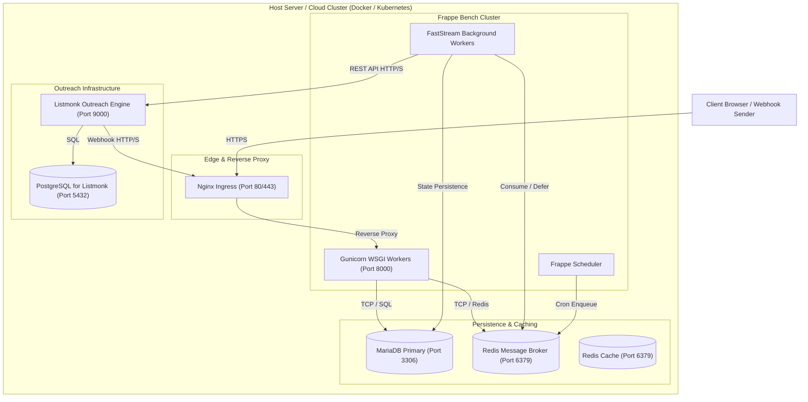

# Deployment View

## Infrastructure Level 1

### Motivation
A containerized multi-tier deployment ensures strict physical separation between the synchronous user request thread pool (Gunicorn), long-running asynchronous worker queues (FastStream), persistent transactional data (MariaDB), and the standalone cold email engine (Listmonk).

### Quality and/or Performance Features
- **Zero UI Blocking**: Time-consuming external API calls and qualification scans are isolated on FastStream worker nodes.
- **Independent Elasticity**: Background workers can scale horizontally based on queue depth metrics in Redis.
- **Fail-Safe Webhook Gateway**: Inbound webhooks pass through Nginx SSL termination before reaching Gunicorn.

### Mapping of Building Blocks to Infrastructure

| Building Block | Target Node / Container | Ports | Protocols |
| :--- | :--- | :--- | :--- |
| **Desk UI / Web API** | `Gunicorn WSGI Container` | 8000 | HTTP / WSGI |
| **Queue Workers** | `FastStream Worker Container` | - | Redis TCP |
| **Scheduler** | `Frappe Scheduler Container` | - | Redis TCP |
| **DocType Database** | `MariaDB Container` | 3306 | MySQL Protocol |
| **Message Broker** | `Redis Queue Container` | 6379 | RESP Protocol |
| **Email Sequence Engine** | `Listmonk Service Container` | 9000 | HTTP / REST |

## Infrastructure Level 2
- **Environment Configuration**: Listmonk credentials and secrets configured via `sites/<site>/site_config.json` or encrypted inside [`Listmonk Settings`](apps/frappe_cadence/frappe_cadence/cadence/doctype/listmonk_settings/listmonk_settings.py:8).
- **Network Isolation**: All backend containers communicate within an internal Docker bridge network, exposing only ports 80/443 publicly via Nginx.
