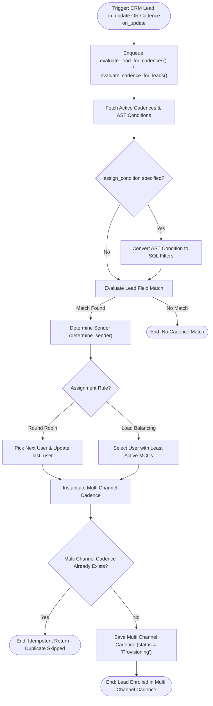

# 01 Lead Cadence Enrollment Workflow

This workflow documents the automatic evaluation and enrollment of leads into sales cadences, triggered by updates to either [`frappe_crm.doctype.crm_lead.crm_lead`](apps/frappe_cadence/frappe_cadence/cadence/doctype/cadence/cadence.py:169) or [`frappe_cadence.cadence.doctype.cadence.cadence`](apps/frappe_cadence/frappe_cadence/cadence/doctype/cadence/cadence.py:128).

## Workflow Diagram

## Step Specifications

1. **Trigger**:
   - `CRM Lead on_update` hook enqueues `evaluate_lead_for_cadences(lead_name)`.
   - `Cadence on_update` hook enqueues `evaluate_cadence_for_leads(cadence_name)`.
2. **Condition AST Parsing**:
   - Parses Python conditions (`doc.status == "New" and doc.annual_revenue > 50000`) into structured JSON SQL filters via [`_ast_to_filters`](apps/frappe_cadence/frappe_cadence/cadence/doctype/cadence/cadence.py:67).
3. **Sender Determination**:
   - Implements `Round Robin` or `Load Balancing` across user pools in [`determine_sender`](apps/frappe_cadence/frappe_cadence/cadence/doctype/cadence/cadence.py:272).
4. **Enrollment**:
   - Creates a new [`frappe_cadence.cadence.doctype.multi_channel_cadence.multi_channel_cadence`](apps/frappe_cadence/frappe_cadence/cadence/doctype/multi_channel_cadence/multi_channel_cadence.py:32) record in `Provisioning` state.
