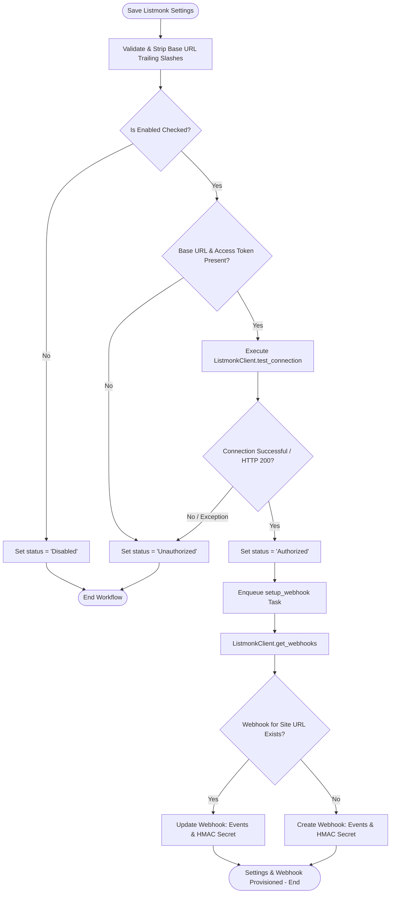

# Behavioral Workflows (BPMN): Listmonk Settings & Webhook Provisioning

## 🎯 Primary Workflow: Settings Authorization & Webhook Provisioning Workflow

## 📝 Workflow Step Descriptions

1. **Save Listmonk Settings**: Triggered via Desk UI when [`Listmonk Settings`](apps/frappe_cadence/frappe_cadence/cadence/doctype/listmonk_settings/listmonk_settings.py:8) is inserted or updated.
2. **URL Validation**: [`ListmonkSettings.validate()`](apps/frappe_cadence/frappe_cadence/cadence/doctype/listmonk_settings/listmonk_settings.py:9) strips trailing slashes from the API base URL.
3. **Enabled Check**: If `enabled = 0`, sets `status = 'Disabled'`.
4. **Credential Verification**: Ensures both `base_url` and `access_token` exist in settings or `site_config.json`.
5. **Connection Test**: Executes [`ListmonkClient.test_connection()`](apps/frappe_cadence/frappe_cadence/integrations/listmonk/client.py:140) against `/api/sequences`.
6. **Authorization State**: If valid, updates `status = 'Authorized'`.
7. **Automated Webhook Setup**: Enqueues [`setup_webhook()`](apps/frappe_cadence/frappe_cadence/integrations/listmonk/jobs/webhook.py:21) which provisions or updates the site's webhook subscription in Listmonk with HMAC secret authentication.
