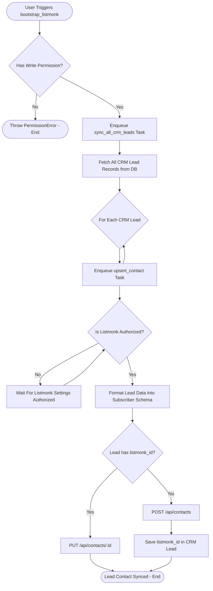

# Behavioral Workflows (BPMN): Listmonk Lead Bootstrap

## 🎯 Primary Workflow: Listmonk Lead Bootstrap Workflow

## 📝 Workflow Step Descriptions

1. **Bootstrap Trigger**: Authorized user invokes [`ListmonkSettings.bootstrap_listmonk()`](apps/frappe_cadence/frappe_cadence/cadence/doctype/listmonk_settings/listmonk_settings.py:41) via API or Desk action.
2. **Permission Check**: Validates `has_permission("Listmonk Settings", "write")`.
3. **Enqueue Lead Discovery**: [`sync_all_crm_leads()`](apps/frappe_cadence/frappe_cadence/integrations/listmonk/jobs/contact.py:59) queries all existing `CRM Lead` names.
4. **Fan-out Tasks**: Spawns individual asynchronous [`upsert_contact()`](apps/frappe_cadence/frappe_cadence/integrations/listmonk/jobs/contact.py:15) jobs.
5. **Authorization Wait**: Worker invokes [`ensure_listmonk_authorized()`](apps/frappe_cadence/frappe_cadence/integrations/listmonk/client.py:30) to suspend/wait until Listmonk is marked `Authorized`.
6. **Subscriber Upsert**: Pushes subscriber email, name, and contact attributes to Listmonk and updates `listmonk_id` on the `CRM Lead` record.
