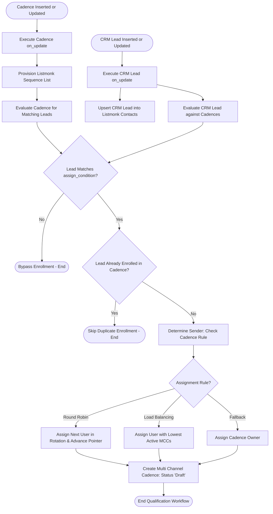

# Behavioral Workflows (BPMN): Lead Qualification and Enrollment

## 🎯 Primary Workflow: Qualification & Assignment Workflow

## 📝 Workflow Step Descriptions

1. **CRM Lead & Cadence Triggers**: Changes to [`CRM Lead`](apps/frappe_cadence/frappe_cadence/cadence/doctype/crm_lead/crm_lead.py:6) or [`Cadence`](apps/frappe_cadence/frappe_cadence/cadence/doctype/cadence/cadence.py:113) invoke background tasks using `frappe.enqueue`.
2. **Provision Listmonk Sequence List**: Calls [`upsert_sequence()`](apps/frappe_cadence/frappe_cadence/jobs/cadence.py:16) to ensure the target sequence mailing list exists in Listmonk.
3. **AST Condition Evaluation**: Translates the human-readable `assign_condition` into structured SQL filters using `ast.parse()`.
4. **Duplicate Enrollment Check**: Verifies if a [`Multi Channel Cadence`](apps/frappe_cadence/frappe_cadence/cadence/doctype/multi_channel_cadence/multi_channel_cadence.py:7) already exists for this lead/cadence pair.
5. **Sender Resolution**: Applies `Round Robin` or `Load Balancing` rules in [`determine_sender()`](apps/frappe_cadence/frappe_cadence/jobs/cadence.py:155).
6. **Multi Channel Cadence Instantiation**: Inserts a new `Multi Channel Cadence` record with status `Draft`.
