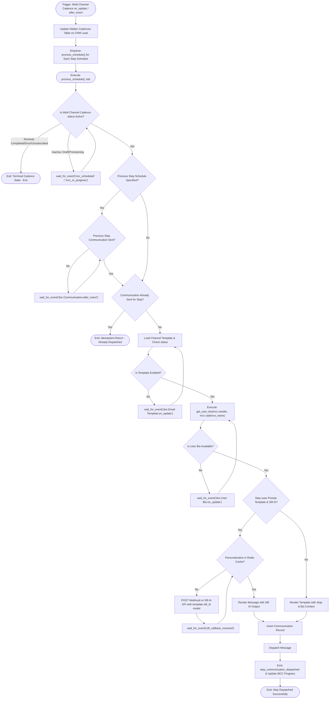

# 03 Multi Channel Cadence Step Scheduling Workflow

This workflow documents multi-step cadence execution across email, SMS, LinkedIn, and WhatsApp channels, triggered by [`frappe_cadence.cadence.doctype.multi_channel_cadence.multi_channel_cadence`](apps/frappe_cadence/frappe_cadence/cadence/doctype/multi_channel_cadence/multi_channel_cadence.py:1) updates.

## Workflow Diagram

## Step Specifications

1. **Sequential Step Dependency**:
   - `process_schedule` uses `wait_for_event()` to pause processing if a preceding step has not completed or if MCC status is `Draft` or `Paused`.
2. **Template & Sift AI Personalization**:
   - Evaluates template enablement, retrieves sender bio context via [`get_user_bio`](apps/frappe_cadence/frappe_cadence/cadence/doctype/user_bio/user_bio.py:25), and optionally posts prompt payloads to external Sift AI services.
3. **Communication Creation**:
   - Generates a [`frappe_cadence.cadence.doctype.communication.communication`](apps/frappe_cadence/frappe_cadence/cadence/doctype/communication/communication.py:1) document tracking channel, step, and output payload.
