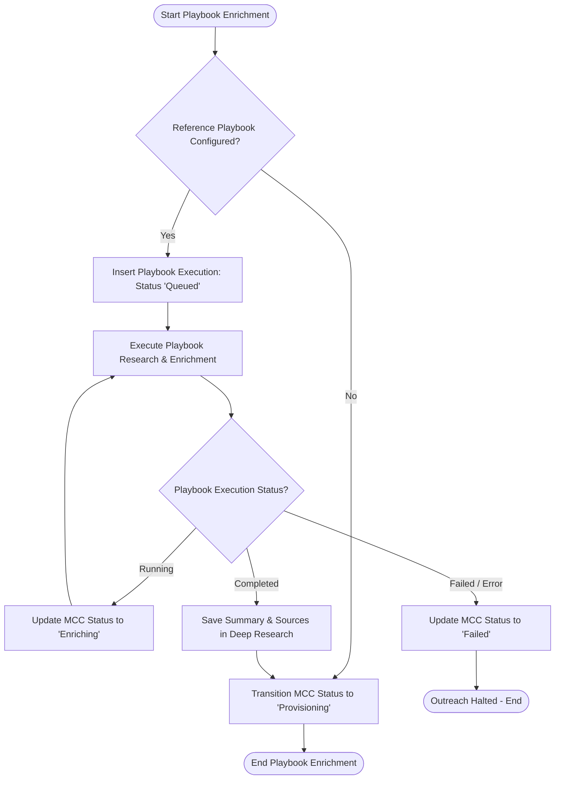

# Behavioral Workflows (BPMN): Playbook Enrichment

## 🎯 Primary Workflow: Playbook Enrichment Workflow

## 📝 Workflow Step Descriptions

1. **Check Playbook Configuration**: Evaluates whether the referenced Cadence specifies an active `reference_playbook`.
2. **Create Playbook Execution**: Instantiates `Playbook Execution` linking the Multi Channel Cadence record.
3. **Execute Playbook**: External worker processes research tasks and crawls company/contact intelligence.
4. **State Handling**: Updates Multi Channel Cadence status to `Enriching` during execution or `Failed` on unrecoverable errors.
5. **Persist Research Context**: Saves research summaries and source references into [`Deep Research`](apps/frappe_listmonk/frappe_listmonk/listmonk/doctype/deep_research/deep_research.py:6).
6. **Transition to Provisioning**: Moves Multi Channel Cadence status to `Provisioning` to signal readiness for sequence synchronization.
