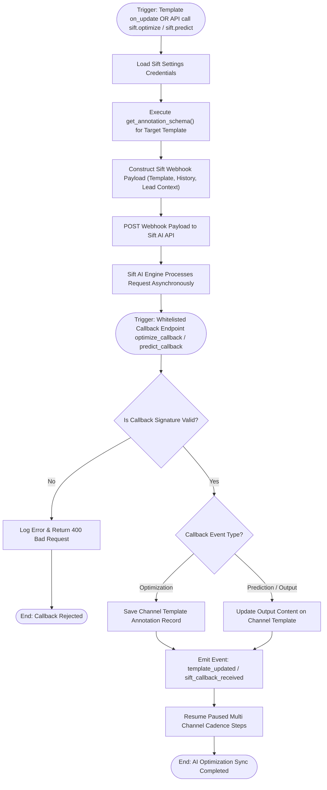

# 04 Sift AI Template Optimization & Prediction Workflow

This workflow documents multi-channel AI prompt optimization and engagement prediction, triggered by template saves or direct invocation of Sift whitelisted API endpoints [`optimize`](apps/frappe_cadence/frappe_cadence/integrations/sift.py:63) and [`predict`](apps/frappe_cadence/frappe_cadence/integrations/sift.py:202).

## Workflow Diagram

## Step Specifications

1. **Trigger & Schema Extraction**:
   - `sift.optimize()` or `sift.predict()` dynamically extracts meta fields and builds strict JSON schemas via [`get_annotation_schema`](apps/frappe_cadence/frappe_cadence/integrations/sift.py:41).
2. **Asynchronous Webhook POST**:
   - Posts template body, lead attributes, and past lead communication history to Sift AI service endpoints.
3. **Webhook Callback Receiver**:
   - [`optimize_callback`](apps/frappe_cadence/frappe_cadence/integrations/sift.py:152) and [`predict_callback`](apps/frappe_cadence/frappe_cadence/integrations/sift.py:279) process inbound webhook payloads.
4. **Annotation & Event Emission**:
   - Writes AI scores and feedback to channel template annotation records (`Email Template Annotation`, `SMS Template Annotation`, etc.) and broadcasts events to unblock paused step queues.
