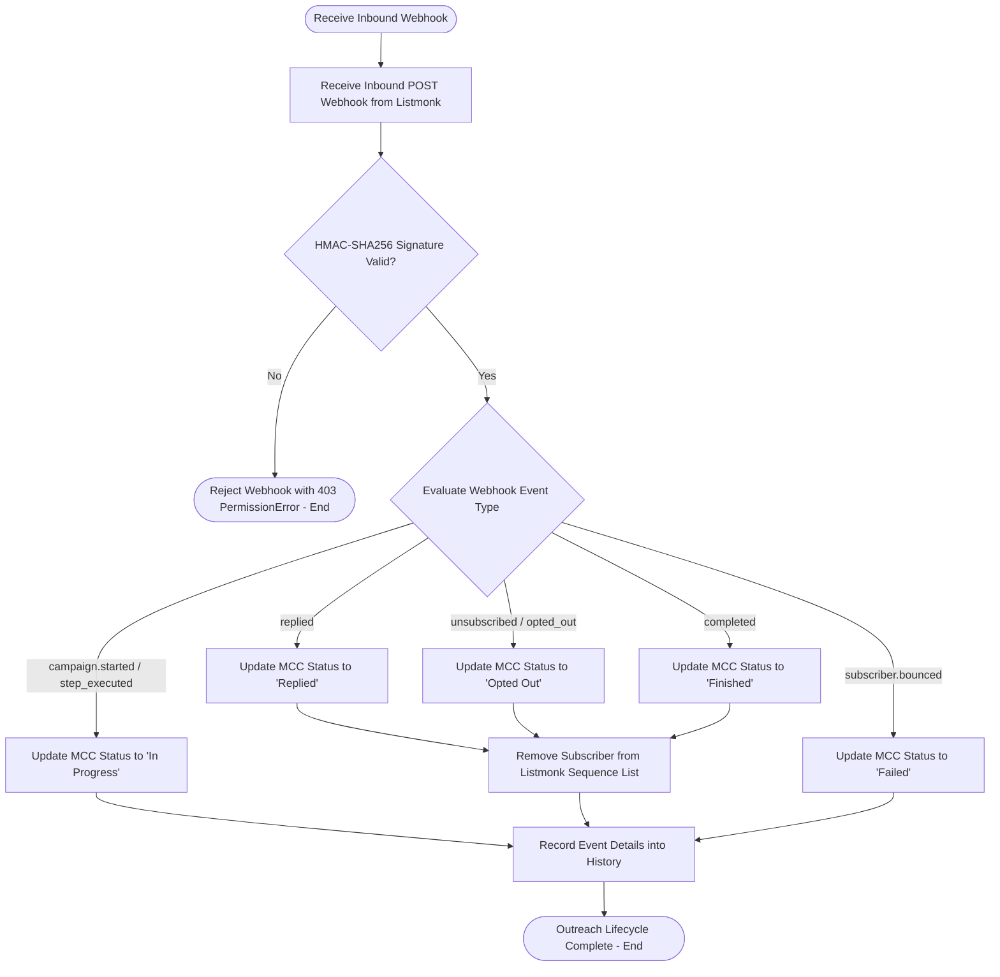

# Behavioral Workflows (BPMN): Webhook Feedback & Engagement

## 🎯 Primary Workflow: Webhook Ingestion & Engagement Tracking Workflow

## 📝 Workflow Step Descriptions

1. **Receive Webhook**: Listmonk pushes engagement events (open, click, step delivery, bounce, unsubscribe) to [`webhook()`](apps/frappe_cadence/frappe_cadence/integrations/listmonk/jobs/webhook.py:68).
2. **Verify HMAC-SHA256 Signature**: Checks payload against `Listmonk-Signature` using `hmac.compare_digest()`.
3. **Parse Event Payload**: Evaluates event strings and maps them to Multi Channel Cadence status targets.
4. **Transition Status**: Updates [`Multi Channel Cadence`](apps/frappe_cadence/frappe_cadence/cadence/doctype/multi_channel_cadence/multi_channel_cadence.py:7) status in the database.
5. **Sequence Disassociation**: Automatically unenrolls leads upon reply, opt-out, or completion via [`remove_subscriber_from_sequence()`](apps/frappe_cadence/frappe_cadence/jobs/multi_channel_cadence.py:99).
6. **Interaction Audit Logging**: Records engagement timestamps and metadata into [`History`](apps/frappe_cadence/frappe_cadence/cadence/doctype/history/history.py:10).
