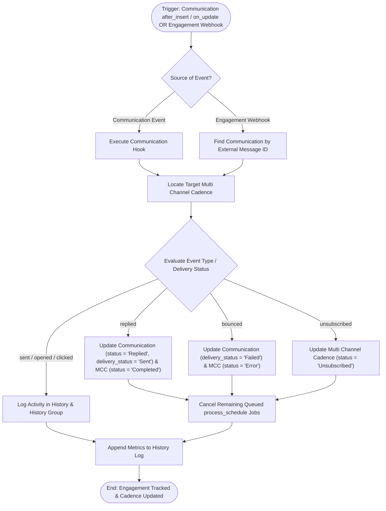

# 05 Communication Engagement Tracking Workflow

This workflow documents external engagement tracking (opens, clicks, replies, bounces) and communication lifecycle management, triggered by [`frappe_cadence.cadence.doctype.communication.communication`](apps/frappe_cadence/frappe_cadence/cadence/doctype/communication/communication.py:1) doc events and webhook invocations.

## Workflow Diagram

## Step Specifications

1. **Trigger & Delivery Webhook**:
   - Outbound and inbound events invoke webhook callbacks with contextual metadata (lead email/phone, message ID).
2. **Engagement Evaluation**:
   - Categorizes events into informational engagement (`opened`, `clicked`) versus cadence terminal events (`replied`, `bounced`, `unsubscribed`).
3. **MCC State & Queue Cancellation**:
   - Terminal events transition [`frappe_cadence.cadence.doctype.multi_channel_cadence.multi_channel_cadence`](apps/frappe_cadence/frappe_cadence/cadence/doctype/multi_channel_cadence/multi_channel_cadence.py:12) to `Completed`, `Error`, or `Unsubscribed` and emit events to terminate pending scheduled steps.
4. **History Logging**:
   - Writes timeline interactions into [`frappe_cadence.cadence.doctype.history.history`](apps/frappe_cadence/frappe_cadence/cadence/doctype/history/history.py:1) for reporting and analytics.
