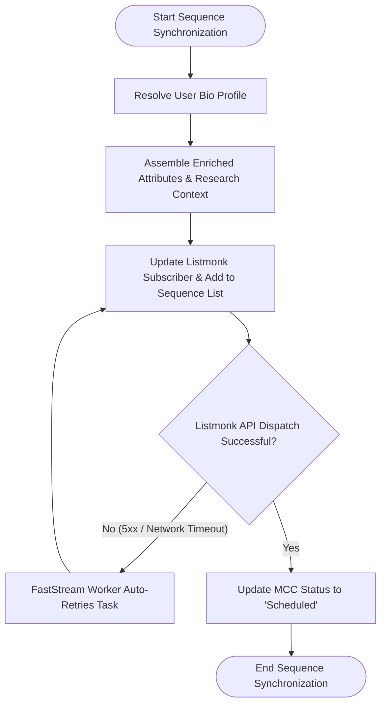

# Behavioral Workflows (BPMN): Listmonk Sequence Synchronization

## 🎯 Primary Workflow: Listmonk Sequence Synchronization Workflow

## 📝 Workflow Step Descriptions

1. **Resolve User Bio Profile**: Evaluates [`User Bio`](apps/frappe_cadence/frappe_cadence/cadence/doctype/user_bio/user_bio.py:8) according to precedence rules (cadence-specific override first, then default user bio).
2. **Assemble Payload**: Consolidates lead attributes, company dossier from [`Deep Research`](apps/frappe_cadence/frappe_cadence/cadence/doctype/deep_research/deep_research.py:6), and sender details into dynamic subscriber attributes (`attribs.deep_research`).
3. **Sync Subscriber & Sequence**: Dispatches HTTP PUT requests via [`ListmonkClient`](apps/frappe_cadence/frappe_cadence/integrations/listmonk/client.py:63) to associate the contact with the Listmonk campaign sequence list.
4. **Transient Retry Handling**: Allows network failures to bubble up so FastStream automatically retries with backoff without dropping jobs.
5. **Update Status**: Updates [`Multi Channel Cadence`](apps/frappe_cadence/frappe_cadence/cadence/doctype/multi_channel_cadence/multi_channel_cadence.py:7) status to `Scheduled`.
