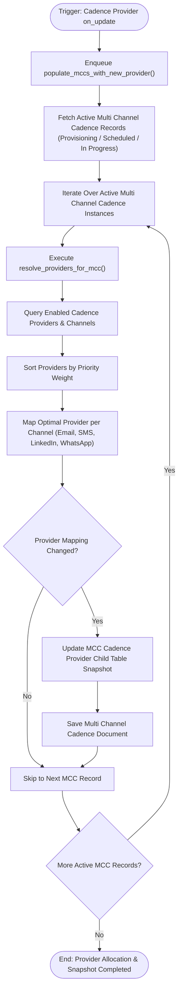

# 06 Cadence Provider Allocation Workflow

This workflow documents provider registration, channel router resolution, and active MCC provider re-allocation, triggered by updates to [`frappe_cadence.cadence.doctype.cadence_provider.cadence_provider`](apps/frappe_cadence/frappe_cadence/cadence/doctype/cadence_provider/cadence_provider.py:10).

## Workflow Diagram

## Step Specifications

1. **Trigger & Background Dispatch**:
   - `Cadence Provider on_update` enqueues [`populate_mccs_with_new_provider`](apps/frappe_cadence/frappe_cadence/cadence/doctype/cadence_provider/cadence_provider.py:22) in background worker queues.
2. **Channel Router Resolution**:
   - [`resolve_providers_for_mcc`](apps/frappe_cadence/frappe_cadence/cadence/doctype/cadence_provider/cadence_provider.py:104) ranks available providers by priority and matching channel flags.
3. **MCC Snapshot Re-population**:
   - Re-snapshots child table [`frappe_cadence.cadence.doctype.mcc_cadence_provider.mcc_cadence_provider`](apps/frappe_cadence/frappe_cadence/cadence/doctype/mcc_cadence_provider/mcc_cadence_provider.py:1) for active cadence instances without interrupting scheduled steps.
