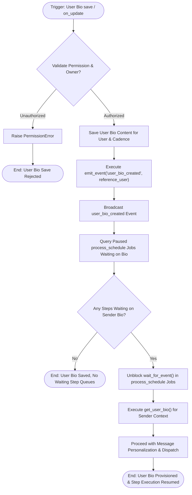

# 07 User Bio Provisioning Workflow

This workflow documents sender bio creation, privacy validation, and event-driven step queue wake-up, triggered by updates to [`frappe_cadence.cadence.doctype.user_bio.user_bio`](apps/frappe_cadence/frappe_cadence/cadence/doctype/user_bio/user_bio.py:5).

## Workflow Diagram

## Step Specifications

1. **Trigger & Permission Check**:
   - `User Bio` validates that non-admin users can only create/modify bios where `reference_user` matches `frappe.session.user` ([`has_permission`](apps/frappe_cadence/frappe_cadence/cadence/doctype/user_bio/user_bio.py:11)).
2. **Event Emission**:
   - `on_update` triggers `emit_event("user_bio_created", ...)` to notify reactive event listeners.
3. **Step Queue Resolution**:
   - Background tasks paused in [`process_schedule`](apps/frappe_cadence/frappe_cadence/cadence/doctype/multi_channel_cadence/multi_channel_cadence.py:161) resume execution, rendering personalized AI prompts with the newly provisioned bio.
