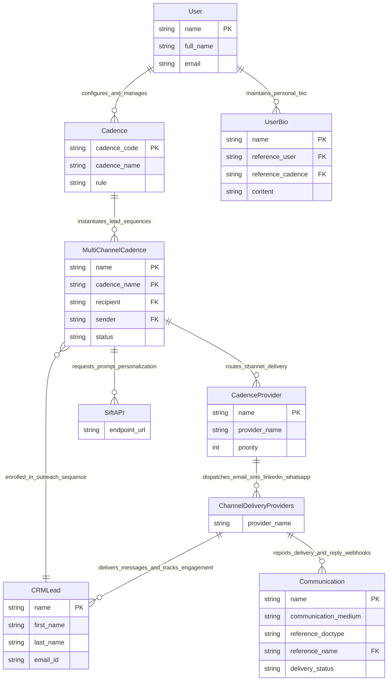

# C1: System Context Diagram

## 🎯 System Boundaries
This document defines the C1 System Context and external boundaries for the `frappe_cadence` application.

## 📊 Context ERD

## 📝 Entity Descriptions
- **User**: Sales representative, account executive, or system administrator operating the CRM desk.
- **Cadence**: Master multi-step sales cadence template defining triggers, steps, rules, and user pools.
- **UserBio**: Personal sender bio and background context used by Sift API during template optimization.
- **CRMLead**: Target prospect record containing lead attributes, assignment tags, and cadence references.
- **MultiChannelCadence**: Active execution instance tracking a specific lead's progression through cadence schedule steps.
- **CadenceProvider**: Integrated multi-channel provider configuration with router weights.
- **Communication**: System communication record logging dispatched outreach messages and engagement status.
- **SiftAPI**: External Sift optimization and prediction API service.
- **ChannelDeliveryProviders**: Third-party outreach channels (e.g. SendGrid, Twilio, LinkedIn, WhatsApp).
