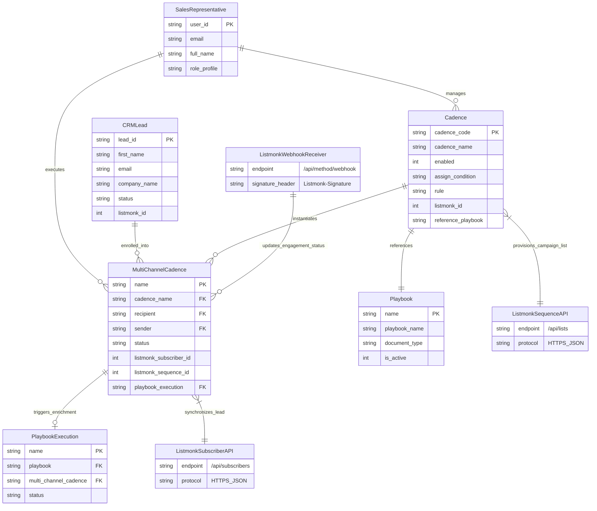

# C1: System Context Diagram

## 🎯 System Boundaries
This document defines the high-level system context, primary domain entities, external systems, and user actors interacting with [`frappe_cadence`](apps/frappe_cadence/frappe_cadence/hooks.py:1).

## 📊 Context ERD

## 📝 Entity Descriptions

- **SalesRepresentative**: Sales user or manager who configures automated cadences, provides personal bio profiles, and oversees outreach execution.
- **CRMLead**: Prospective client record in Frappe CRM containing demographic, organization, and contact channel details.
- **Cadence**: Template defining outreach campaign strategies, AST-evaluated qualification criteria, sender distribution rules, and attached playbooks.
- **MultiChannelCadence**: Concrete instance of an enrolled lead navigating an active outreach sequence with associated sender profile and progression status.
- **Playbook**: Automated enrichment workflow definition orchestrating contextual research and data gathering tasks.
- **PlaybookExecution**: Runtime tracking document for an executing enrichment run for a specific MultiChannelCadence.
- **ListmonkSubscriberAPI**: External REST endpoint for creating and updating subscriber attributes and list memberships.
- **ListmonkSequenceAPI**: External REST endpoint for provisioning and status management of campaign mailing lists.
- **ListmonkWebhookReceiver**: Inbound webhook handler validating HMAC-SHA256 signatures and recording delivery and engagement updates.
