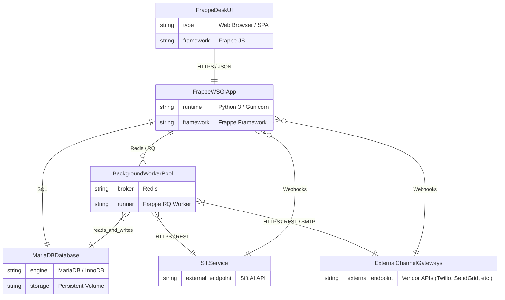

# C2: Container Diagram

## 🎯 Container Architecture
This document defines the runnable services, databases, queues, and external API integrations for the `frappe_cadence` application.

## 📊 Container ERD

## 📝 Container Descriptions
- **FrappeDeskUI**: User-facing web application serving the interactive UI for managing Cadences, Templates, and Analytics.
- **FrappeWSGIApp**: Core backend API handling business logic, whitelisted endpoints, and inbound webhooks.
- **MariaDBDatabase**: Primary transactional datastore for domain aggregates (`Cadence`, `Multi Channel Cadence`, `Communication`, etc.).
- **BackgroundWorkerPool**: Message broker and background workers managing asynchronous job execution (`process_schedule`, assignments).
- **SiftService**: External AI service providing prompt personalization and optimization.
- **ExternalChannelGateways**: External third-party APIs for dispatching emails, SMS, LinkedIn messages, and WhatsApp.
