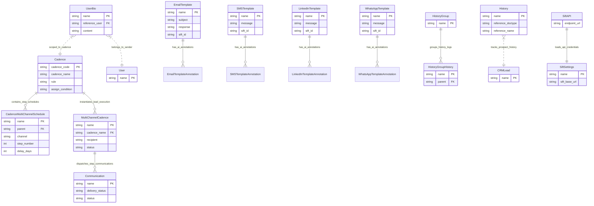

# C3: Component Diagram

## 🎯 Component Architecture
This document defines the C3 Component model for the `frappe_cadence` application, breaking down the internal modules and controllers.

## 📊 Component ERD

## 📝 Component Descriptions
- **Cadence**: Master orchestration DocType tracking schedules, assignment rules, and linked playbook executions.
- **CadenceMultiChannelSchedule**: Child table specifying individual channel steps (Email, SMS, etc.) and delay intervals.
- **MultiChannelCadence**: Active execution tracking for a specific `CRMLead`, managing state from `Provisioning` to `Completed` or `Error`.
- **UserBio**: Sender's personal bio injected into Sift API prompts for personalized messaging.
- **Communication**: Standard Frappe DocType used to track outgoing messages and delivery statuses.
- **EmailTemplate**, **SMSTemplate**, etc.: Channel-specific templates holding the base prompt or static message, and the `sift_id` AI model reference.
- **History**, **HistoryGroup**: Entities for tracking the chronological sequence of events and engagement.
- **SiftSettings**: Single DocType securely storing Sift API keys and base URLs.
