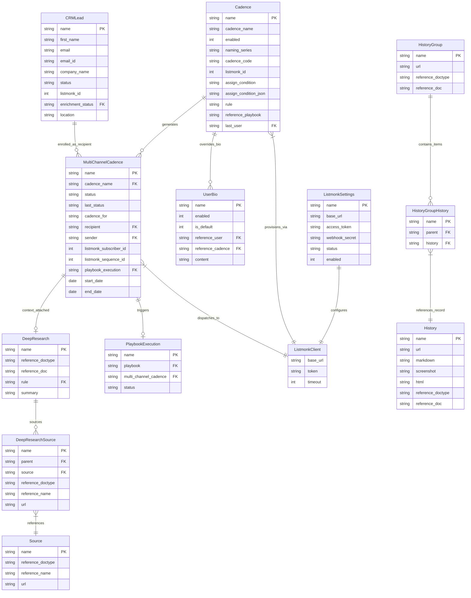

# C3: Component Diagram

## 🎯 Component Architecture
This document details the internal DocType models, controller components, integration handlers, and relationship cardinalities within [`frappe_listmonk`](apps/frappe_listmonk/frappe_listmonk/hooks.py:1).

## 📊 Component ERD

## 📝 Component Descriptions

- **Cadence**: Core configuration DocType containing condition definitions, assignment strategy (Round Robin vs Load Balancing), and sequence metadata.
- **MultiChannelCadence**: State-machine managing document tracking each prospect's lifecycle from `Draft` through `Enriching`, `Provisioning`, `Scheduled`, `In Progress`, and terminal states (`Replied`, `Finished`, `Opted Out`, `Failed`).
- **CRMLead**: Lead record representing the prospect, carrying demographic data, enrichment flags, and Listmonk subscriber ID pointers.
- **UserBio**: Personalization profile providing sender identity bios customized per sales rep and specific outreach cadence.
- **DeepResearch**: Structured dossier and AI research summary collected during playbook enrichment, attached with source references.
- **DeepResearchSource**: Child table linking research source records and reference URLs to a DeepResearch document.
- **Source**: Standalone reference DocType storing web source URLs and linked entity metadata.
- **History**: Granular log of crawled web pages, markdown content, and screenshot attachments associated with CRM documents.
- **HistoryGroup**: Aggregate container bundling multiple history items for a target URL.
- **HistoryGroupHistory**: Child table joining history items into a HistoryGroup.
- **PlaybookExecution**: Background runner orchestrating multi-step research and intelligence gathering before outreach dispatch.
- **ListmonkSettings**: Single DocType configuring API authentication tokens, base URLs, and automated webhook subscriptions for Listmonk.
- **ListmonkClient**: Dedicated HTTP communication wrapper exposing typed methods for managing subscribers, sequences, campaigns, and webhooks.
