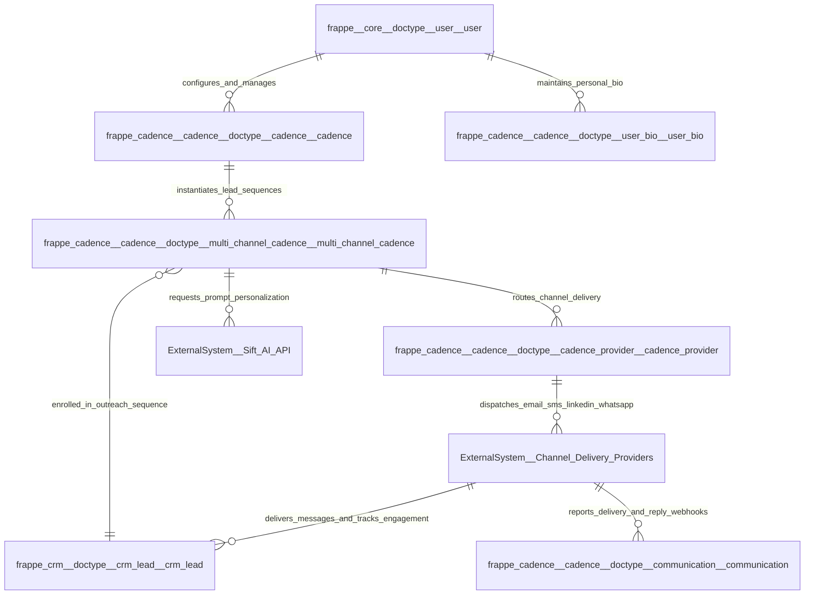

# 03 Context and Scope

This document defines the system context and organizational boundaries for [`apps/frappe_cadence/frappe_cadence/hooks.py`](apps/frappe_cadence/frappe_cadence/hooks.py:1).

## System Context Diagram

For complete system boundaries and entity definitions, see the [C1 System Context Model](../c4/01-context.md).

## Boundary & Scope Definitions

- **Internal Boundaries**:
  - `frappe_cadence` manages Cadences, Multi Channel Cadences, Templates, Provider Channels, User Bios, and Communication history.
  - Interacts with `crm` app to read lead details and update lead cadence references.
  - Interacts with `frappe_playbook` to manage sales playbook execution lifecycles.
- **External Interfaces**:
  - **Sift AI API**: Transmits prompt optimization payloads and receives webhook callbacks with AI scores and suggestions ([`apps/frappe_cadence/frappe_cadence/integrations/sift.py`](apps/frappe_cadence/frappe_cadence/integrations/sift.py:4)).
  - **Channel Delivery Gateways**: External provider services (SMTP/SendGrid, Twilio, LinkedIn, WhatsApp) handling actual message dispatch and engagement webhook reporting ([`apps/frappe_cadence/frappe_cadence/cadence/doctype/cadence_provider/cadence_provider.py`](apps/frappe_cadence/frappe_cadence/cadence/doctype/cadence_provider/cadence_provider.py:53)).
