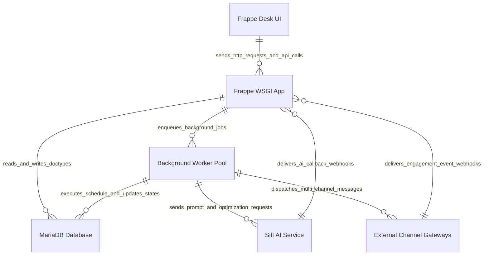

# 05 Building Block View

This document provides the building block hierarchy for [`apps/frappe_cadence/frappe_cadence/hooks.py`](apps/frappe_cadence/frappe_cadence/hooks.py:1).

## Level 1: Container View

For detailed container specifications, see the [C2 Container Model](../c4/02-container.md).

## Level 2: Component View

For detailed component and DocType entity relationship specifications, see the [C3 Component Model](../c4/03-component.md).

```mermaid
erDiagram
    frappe_cadence__cadence__doctype__cadence__cadence ||--o{ frappe_cadence__cadence__doctype__cadence_multi_channel_schedule__cadence_multi_channel_schedule : "contains_step_schedules"
    frappe_cadence__cadence__doctype__cadence__cadence ||--o{ frappe_cadence__cadence__doctype__multi_channel_cadence__multi_channel_cadence : "instantiates_lead_execution"
    frappe_cadence__cadence__doctype__multi_channel_cadence__multi_channel_cadence ||--o{ frappe_cadence__cadence__doctype__mcc_cadence_provider__mcc_cadence_provider : "contains_provider_snapshots"
    frappe_cadence__cadence__doctype__cadence_provider__cadence_provider ||--o{ frappe_cadence__cadence__doctype__cadence_provider_channel__cadence_provider_channel : "configures_channel_support"
    frappe_cadence__cadence__doctype__mcc_cadence_provider__mcc_cadence_provider }|..|| frappe_cadence__cadence__doctype__cadence_provider__cadence_provider : "references_configured_provider"
    frappe_cadence__cadence__doctype__multi_channel_cadence__multi_channel_cadence ||--o{ frappe_cadence__cadence__doctype__communication__communication : "dispatches_step_communications"
    frappe_cadence__cadence__doctype__user_bio__user_bio }|..|| frappe__core__doctype__user__user : "belongs_to_sender"
    frappe_cadence__cadence__doctype__user_bio__user_bio }|..|| frappe_cadence__cadence__doctype__cadence__cadence : "scoped_to_cadence"
    frappe_cadence__cadence__doctype__email_template__email_template ||--o{ frappe_cadence__cadence__doctype__email_template_annotation__email_template_annotation : "has_ai_annotations"
    frappe_cadence__cadence__doctype__sms_template__sms_template ||--o{ frappe_cadence__cadence__doctype__sms_template_annotation__sms_template_annotation : "has_ai_annotations"
    frappe_cadence__cadence__doctype__linkedin_template__linkedin_template ||--o{ frappe_cadence__cadence__doctype__linkedin_template_annotation__linkedin_template_annotation : "has_ai_annotations"
    frappe_cadence__cadence__doctype__whatsapp_template__whatsapp_template ||--o{ frappe_cadence__cadence__doctype__whatsapp_template_annotation__whatsapp_template_annotation : "has_ai_annotations"
    frappe_cadence__cadence__doctype__history_group__history_group ||--o{ frappe_cadence__cadence__doctype__history_group_history__history_group_history : "groups_history_logs"
    frappe_cadence__cadence__doctype__history__history }|..|| frappe_crm__doctype__crm_lead__crm_lead : "tracks_prospect_history"
    frappe_cadence__integrations__sift ||--|| frappe_cadence__cadence__doctype__sift_settings__sift_settings : "loads_api_credentials"
```

## Component Breakdown

1. **Cadence Engine (`cadence`, `cadence_multi_channel_schedule`, `multi_channel_cadence`)**:
   - Manages rules, AST condition evaluation, step sequence definition, user assignment, and lead execution instances.
2. **Channel Provider Router (`cadence_provider`, `cadence_provider_channel`, `mcc_cadence_provider`)**:
   - Manages multi-channel delivery configurations (Email, SMS, LinkedIn, WhatsApp) and provider priority routing.
3. **Personalization & Sift AI (`sift_settings`, `user_bio`, annotations)**:
   - Houses user bios, Sift AI credentials, prompt prediction logic, and template annotation records.
4. **History & Communications (`history`, `communication`)**:
   - Tracks outgoing communications, engagement metrics, and historical activity logs per prospect.
