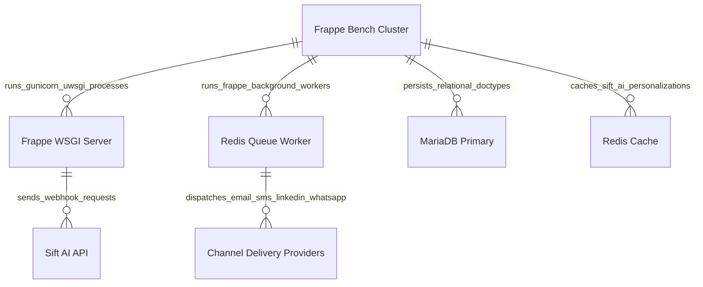

# 07 Deployment View

This document details the infrastructure and deployment topology for [`apps/frappe_cadence/frappe_cadence/hooks.py`](apps/frappe_cadence/frappe_cadence/hooks.py:1).

## Infrastructure Mapping

## Infrastructure Specifications

| Node / Element | Software Stack | Role & Purpose |
| :--- | :--- | :--- |
| **Frappe WSGI Server** | Python 3, Gunicorn / Frappe HTTP Server | Serves desk requests, processes whitelisted API calls, and handles inbound webhook callbacks (`optimize_callback`, `predict_callback`, `report_event`). |
| **Redis Queue Worker** | Redis Streams / RQ Workers | Asynchronously processes background tasks like `process_schedule` and `evaluate_cadence_for_leads`. Governed by rate limits in `controller_events` ([`hooks.py`](apps/frappe_cadence/frappe_cadence/hooks.py:182)). |
| **MariaDB Primary** | MariaDB 10.6+ InnoDB | Relational database storing Cadences, Multi Channel Cadences, Templates, Annotations, User Bios, and Communication history. |
| **Redis Cache** | Redis In-Memory Store | Caches Sift AI prompt personalization outputs to prevent redundant API calls during step re-runs. |
| **Sift AI API** | Cloud SaaS Service | Evaluates outreach prompt templates and predicts engagement metrics. |
| **Channel Delivery Providers** | Email/SMS/LinkedIn/WhatsApp Vendors | Dispatches messages to target leads and posts delivery/engagement webhooks back to Frappe WSGI web servers. |
