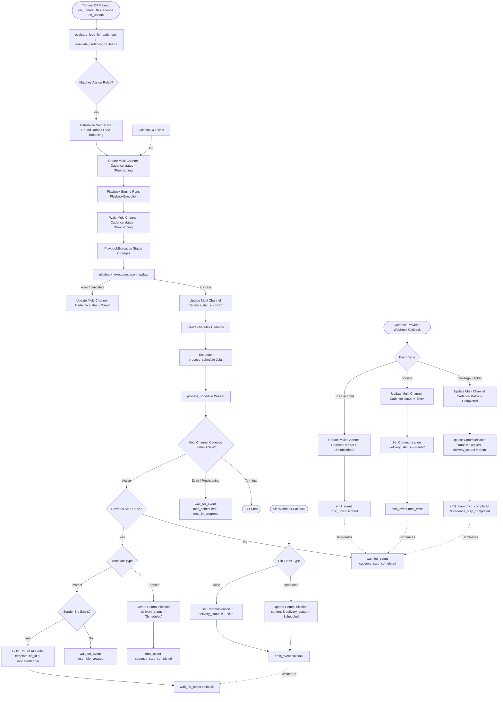

# Behavioral Workflows (BPMN)

## 🎯 Primary Workflow: End-to-End Multi-Channel Execution Workflow

## 📝 Workflow Step Descriptions
1. **Enrollment**: Automatically triggered by `CRM Lead` or `Cadence` updates. Evaluates assignment conditions and assigns a sender using Load Balancing or Round Robin before instantiating the `Multi Channel Cadence` in the `Provisioning` state.
2. **Provisioning**: The `Multi Channel Cadence` waits for its linked `PlaybookExecution` to complete. Upon successful execution, the status transitions to `Draft`.
3. **Orchestration & Scheduling**: Once scheduled by the user, the status transitions to `Scheduled` or `In Progress`, enqueuing asynchronous `process_schedule` worker jobs.
4. **Step Processing**: The worker handles sequence ordering by waiting for the previous step to complete. It evaluates the template:
    - For `Enabled` templates, it directly creates a `Communication`.
    - For `Prompt` templates, it fetches the sender's `User Bio`, queries the `Sift API` for AI content optimization based on `template.sift_id`, and waits for a callback.
5. **Webhook Callback**: The Sift callback updates the draft `Communication` with the AI-generated content and resumes the suspended worker.
6. **Engagement Tracking**: The `Cadence Provider` webhook processes engagement events (`message_replied`, `bounce`, `unsubscribed`) and automatically updates the `Multi Channel Cadence` status, propagating terminal events to clean up any sleeping orchestration threads.
