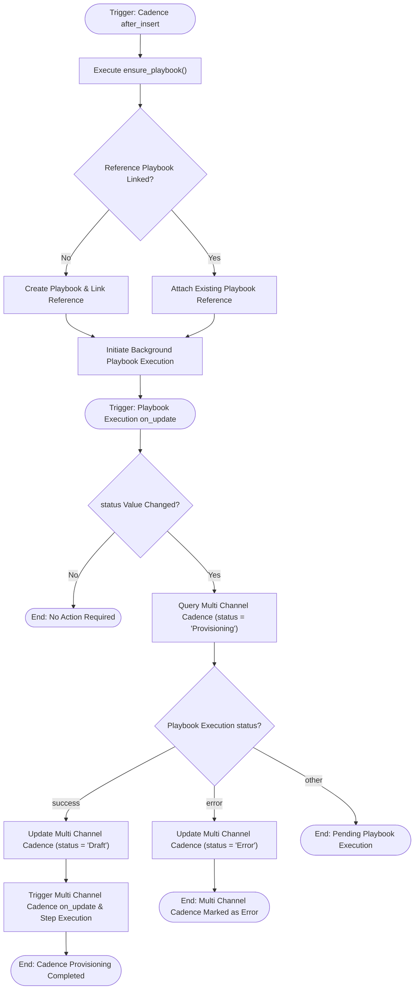

# 02 Playbook Execution Provisioning Workflow

This workflow documents the automatic playbook creation and asynchronous execution status updates that transition cadence records from `Provisioning` to `Draft` or `Error`, triggered by [`frappe_cadence.cadence.doctype.cadence.cadence`](apps/frappe_cadence/frappe_cadence/cadence/doctype/cadence/cadence.py:41) insertion and [`frappe_cadence.cadence.doctype.playbook_execution.playbook_execution`](apps/frappe_cadence/frappe_cadence/cadence/doctype/playbook_execution/playbook_execution.py:4) updates.

## Workflow Diagram

## Step Specifications

1. **Cadence Creation & Playbook Association**:
   - `Cadence after_insert` hook invokes `ensure_playbook()` to establish the associated Playbook instance.
2. **Asynchronous Execution Event**:
   - `Playbook Execution on_update` hook in [`playbook_execution.py`](apps/frappe_cadence/frappe_cadence/cadence/doctype/playbook_execution/playbook_execution.py:4) listens for state transitions.
3. **Provisioning Transition**:
   - When status reaches `success`, linked [`frappe_cadence.cadence.doctype.multi_channel_cadence.multi_channel_cadence`](apps/frappe_cadence/frappe_cadence/cadence/doctype/multi_channel_cadence/multi_channel_cadence.py:32) documents move from `Provisioning` to `Draft`, unlocking background schedule processing.
