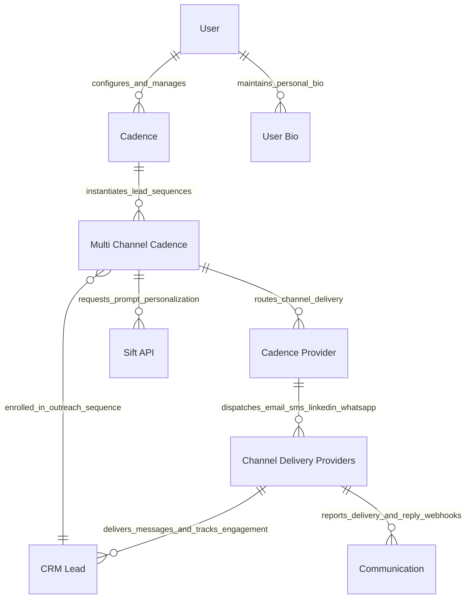

# C1 System Context Model

This document defines the C1 System Context for the [`apps/frappe_cadence/frappe_cadence/hooks.py`](apps/frappe_cadence/frappe_cadence/hooks.py:1) application within the Frappe ecosystem.

## Context Diagram

## Entity Descriptions

| Entity Name | Description | Framework Scope |
| :--- | :--- | :--- |
| `"User"` | Sales representative, account executive, or system administrator operating the CRM desk. | Core Frappe Framework |
| `"Cadence"` | Master multi-step sales cadence template defining triggers, steps, rules, and user pools. | [`apps/frappe_cadence/frappe_cadence/cadence/doctype/cadence/cadence.py`](apps/frappe_cadence/frappe_cadence/cadence/doctype/cadence/cadence.py:33) |
| `"User Bio"` | Personal sender bio and background context used by Sift during template optimization. | [`apps/frappe_cadence/frappe_cadence/cadence/doctype/user_bio/user_bio.py`](apps/frappe_cadence/frappe_cadence/cadence/doctype/user_bio/user_bio.py:5) |
| `"CRM Lead"` | Target prospect record containing lead attributes, assignment tags, and cadence references. | `crm` App |
| `"Multi Channel Cadence"` | Active execution instance tracking a specific lead's progression through cadence schedule steps. | [`apps/frappe_cadence/frappe_cadence/cadence/doctype/multi_channel_cadence/multi_channel_cadence.py`](apps/frappe_cadence/frappe_cadence/cadence/doctype/multi_channel_cadence/multi_channel_cadence.py:32) |
| `"Cadence Provider"` | Integrated multi-channel provider configuration (Email, SMS, LinkedIn, WhatsApp) with router weights. | [`apps/frappe_cadence/frappe_cadence/cadence/doctype/cadence_provider/cadence_provider.py`](apps/frappe_cadence/frappe_cadence/cadence/doctype/cadence_provider/cadence_provider.py:10) |
| `"Communication"` | System communication record logging dispatched outreach messages and engagement status. | [`apps/frappe_cadence/frappe_cadence/cadence/doctype/communication/communication.py`](apps/frappe_cadence/frappe_cadence/cadence/doctype/communication/communication.py:2) |
| `"Sift API"` | External Sift optimization and prediction API service (`sift.optimize`, `sift.predict`). | [`apps/frappe_cadence/frappe_cadence/integrations/sift.py`](apps/frappe_cadence/frappe_cadence/integrations/sift.py:4) |
| `"Channel Delivery Providers"` | Third-party outreach channels (e.g. SMTP/SendGrid, Twilio SMS, LinkedIn API, WhatsApp Business API). | External SaaS Services |
