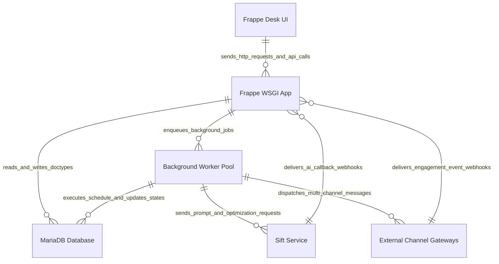

# C2 Container Architecture Model

This document defines the C2 Container diagram for [`apps/frappe_cadence/frappe_cadence/hooks.py`](apps/frappe_cadence/frappe_cadence/hooks.py:1) and its infrastructural dependencies.

## Container Diagram

## Container Specifications

| Container | Technology / Protocol | Purpose / Responsibility |
| :--- | :--- | :--- |
| `Frappe Desk UI` | Web Browser, HTML5, Frappe JS | Client interface for managing Cadences, Multi-Channel Schedules, Templates, User Bios, and Providers. |
| `Frappe WSGI App` | Python 3, Frappe Framework | Handles HTTP controllers, whitelisted API endpoints, and webhook callback receivers ([`apps/frappe_cadence/frappe_cadence/cadence/email_template.py`](apps/frappe_cadence/frappe_cadence/cadence/email_template.py:5), [`apps/frappe_cadence/frappe_cadence/integrations/sift.py`](apps/frappe_cadence/frappe_cadence/integrations/sift.py:151)). |
| `MariaDB Database` | MariaDB / InnoDB Engine | Relational database storing all Cadence DocTypes (`Cadence`, `Multi Channel Cadence`, `User Bio`, `Cadence Provider`, `History`, `Communication`, etc.). |
| `Background Worker Pool` | Redis Queue, `frappe_controller` Job Manager | Executes background evaluation and step dispatch jobs like `process_schedule`, `evaluate_cadence_for_leads`, and `populate_mccs_with_new_provider` ([`apps/frappe_cadence/frappe_cadence/hooks.py`](apps/frappe_cadence/frappe_cadence/hooks.py:182)). |
| `Sift Service` | HTTPS REST / Webhooks | External Sift engine performing automated template optimization and prompt predictions (`sift.optimize`, `sift.predict`). |
| `External Channel Gateways` | REST / SMTP / Vendor APIs | Third-party messaging gateways handling outbound delivery and inbound delivery/reply webhook notifications. |
