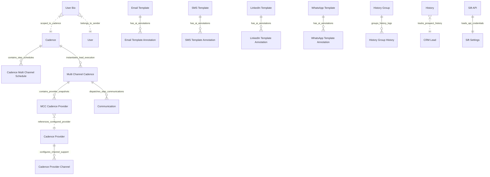

# C3 Component Architecture & Entity Model

This document defines the C3 Component ERD model for [`apps/frappe_cadence/frappe_cadence/hooks.py`](apps/frappe_cadence/frappe_cadence/hooks.py:1).

## Component & Entity Relationship Diagram

## Component Detailed Specifications

### 1. Core Cadence Orchestration DocTypes

#### `"Cadence"`
- **File**: [`apps/frappe_cadence/frappe_cadence/cadence/doctype/cadence/cadence.py`](apps/frappe_cadence/frappe_cadence/cadence/doctype/cadence/cadence.py:33)
- **Primary Key**: `cadence_code` (Data, Unique)
- **Attributes**:
  - `cadence_name`: Data (Required)
  - `enabled`: Check (Default: 1)
  - `reference_playbook`: Link -> `Playbook`
  - `assign_condition`: Small Text (Python expressions)
  - `assign_condition_json`: Code (Hidden parsed AST filters)
  - `rule`: Select (`Round Robin`, `Load Balancing`)
  - `users`: Table MultiSelect -> `Assignment Rule User`
  - `last_user`: Link -> `User`
  - `cadence_schedules`: Table -> `Cadence Multi Channel Schedule`

#### `"Cadence Multi Channel Schedule"`
- **File**: [`apps/frappe_cadence/frappe_cadence/cadence/doctype/cadence_multi_channel_schedule/cadence_multi_channel_schedule.py`](apps/frappe_cadence/frappe_cadence/cadence/doctype/cadence_multi_channel_schedule/cadence_multi_channel_schedule.py:1)
- **Type**: Child Table (`istable: 1`) attached to `Cadence`
- **Attributes**:
  - `channel`: Select (`Email`, `SMS`, `LinkedIn`, `WhatsApp`)
  - `step_number`: Int
  - `delay_days`: Int
  - `template_doctype`: Select (`Email Template`, `SMS Template`, `LinkedIn Template`, `WhatsApp Template`)
  - `template_name`: Dynamic Link
  - `prompt_template`: Text

#### `"Multi Channel Cadence"`
- **File**: [`apps/frappe_cadence/frappe_cadence/cadence/doctype/multi_channel_cadence/multi_channel_cadence.py`](apps/frappe_cadence/frappe_cadence/cadence/doctype/multi_channel_cadence/multi_channel_cadence.py:32)
- **Primary Key**: Name (Expression / Naming Rule)
- **Attributes**:
  - `cadence_name`: Link -> `Cadence`
  - `lead`: Link -> `CRM Lead`
  - `sender`: Link -> `User`
  - `status`: Select (`Provisioning`, `Draft`, `Scheduled`, `In Progress`, `Completed`, `Error`, `Paused`)
  - `provider`: Table -> `MCC Cadence Provider`

#### `"MCC Cadence Provider"`
- **File**: [`apps/frappe_cadence/frappe_cadence/cadence/doctype/mcc_cadence_provider/mcc_cadence_provider.py`](apps/frappe_cadence/frappe_cadence/cadence/doctype/mcc_cadence_provider/mcc_cadence_provider.py:1)
- **Type**: Child Table (`istable: 1`) attached to `Multi Channel Cadence`
- **Attributes**:
  - `channel`: Select (`Email`, `SMS`, `LinkedIn`, `WhatsApp`)
  - `provider`: Link -> `Cadence Provider`

### 2. Multi-Channel Provider Routing DocTypes

#### `"Cadence Provider"`
- **File**: [`apps/frappe_cadence/frappe_cadence/cadence/doctype/cadence_provider/cadence_provider.py`](apps/frappe_cadence/frappe_cadence/cadence/doctype/cadence_provider/cadence_provider.py:10)
- **Primary Key**: Name
- **Attributes**:
  - `provider_name`: Data
  - `enabled`: Check
  - `priority`: Int
  - `channels`: Table -> `Cadence Provider Channel`

#### `"Cadence Provider Channel"`
- **File**: [`apps/frappe_cadence/frappe_cadence/cadence/doctype/cadence_provider_channel/cadence_provider_channel.py`](apps/frappe_cadence/frappe_cadence/cadence/doctype/cadence_provider_channel/cadence_provider_channel.py:1)
- **Type**: Child Table (`istable: 1`) attached to `Cadence Provider`
- **Attributes**:
  - `channel`: Select (`Email`, `SMS`, `LinkedIn`, `WhatsApp`)
  - `enabled`: Check

### 3. Contextual Personalization & Sift Integration

#### `"User Bio"`
- **File**: [`apps/frappe_cadence/frappe_cadence/cadence/doctype/user_bio/user_bio.py`](apps/frappe_cadence/frappe_cadence/cadence/doctype/user_bio/user_bio.py:5)
- **Attributes**:
  - `reference_user`: Link -> `User`
  - `reference_cadence`: Link -> `Cadence` (Optional override)
  - `content`: Text Editor / Markdown

#### `"Sift Settings"`
- **File**: [`apps/frappe_cadence/frappe_cadence/cadence/doctype/sift_settings/sift_settings.py`](apps/frappe_cadence/frappe_cadence/cadence/doctype/sift_settings/sift_settings.py:1)
- **Type**: Single DocType
- **Attributes**:
  - `api_key`: Password
  - `endpoint_url`: Data
  - `webhook_secret`: Password

#### Channel Templates & Annotations
- **Email Template & Annotation**: [`apps/frappe_cadence/frappe_cadence/cadence/doctype/email_template_annotation/email_template_annotation.py`](apps/frappe_cadence/frappe_cadence/cadence/doctype/email_template_annotation/email_template_annotation.py:1)
- **SMS Template & Annotation**: [`apps/frappe_cadence/frappe_cadence/cadence/doctype/sms_template_annotation/sms_template_annotation.py`](apps/frappe_cadence/frappe_cadence/cadence/doctype/sms_template_annotation/sms_template_annotation.py:1)
- **LinkedIn Template & Annotation**: [`apps/frappe_cadence/frappe_cadence/cadence/doctype/linkedin_template_annotation/linkedin_template_annotation.py`](apps/frappe_cadence/frappe_cadence/cadence/doctype/linkedin_template_annotation/linkedin_template_annotation.py:1)
- **WhatsApp Template & Annotation**: [`apps/frappe_cadence/frappe_cadence/cadence/doctype/whatsapp_template_annotation/whatsapp_template_annotation.py`](apps/frappe_cadence/frappe_cadence/cadence/doctype/whatsapp_template_annotation/whatsapp_template_annotation.py:1)

### 4. Background Job & Whitelisted API Modules

- **Sift Integration Module**: [`apps/frappe_cadence/frappe_cadence/integrations/sift.py`](apps/frappe_cadence/frappe_cadence/integrations/sift.py:4)
  - `optimize(template_doctype, template_name)`
  - `predict(template_doctype, template_name)`
  - `optimize_callback(**kwargs)`
  - `predict_callback(**kwargs)`
- **Channel Template Callbacks**:
  - `frappe_cadence.cadence.email_template.callback`
  - `frappe_cadence.cadence.sms_template.callback`
  - `frappe_cadence.cadence.linkedin_template.callback`
  - `frappe_cadence.cadence.whatsapp_template.callback`
